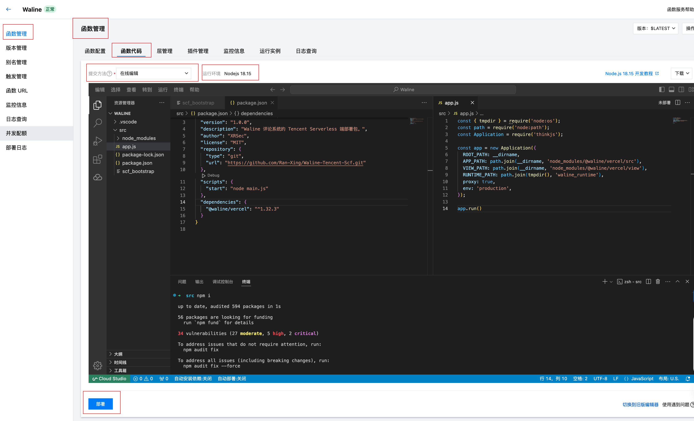

## Waline 腾讯云函数

- [腾讯云函数](https://console.cloud.tencent.com/scf/list-detail)
- [Waline](https://waline.js.org/)
- [Waline 环境变量](https://waline.js.org/reference/server/env.html)
- [评论通知](https://waline.js.org/guide/features/notification.html)

### 使用方法

1. 创建 WEB云函数
2. 运行环境 Nodejs 18.15
3. 下载 最新的 Release, 上传到云函数(本地上传zip包)
4. 打开编辑器, 打开终端, 运行: `npm i`
5. 点击 `部署`



### 特别须知:
> `SITE_URL` 或者 `SERVER_URL` 有一个不能带 `/`
> 
> `高级配置` -> `环境变量` -> 添加对应的环境变量,可参考官网
>
> 数据库信息 (也可创建好后在函数管理函数配置页面编辑添加)
> 

### 禁用注册功能

> 请在 src 目录下执行该命令
>
```bash
[ ! -f app.js ] && echo "请在 src 目录下执行" && exit
SRC_PATH="node_modules/@waline/vercel/src"
[ ! -f "${SRC_PATH}/middleware/blockUserApi.js" ] && echo "module.exports=(o,a)=>async(c,n)=>{if(c.method==='POST'&&c.path==='/api/user'){c.status=403;c.body={error:'This endpoint is disabled by middleware.'};return;}await n();};" > "${SRC_PATH}/middleware/blockUserApi.js"
grep -q "{handle: 'blockUserApi'}" "${SRC_PATH}/config/middleware.js" || sed -i "/module.exports = \[/a\\
  {handle: 'blockUserApi'},
" "${SRC_PATH}/config/middleware.js"
echo "可以部署了！"
```


### 推荐示例:

| **基础配置**  |                     |
|-----------|---------------------|
| 函数类型      | Web函数               |
| 运行环境      | Nodejs 18.15        |
| 时区        | Asia/Shanghai(北京时间) |
|           |                     |
| **环境配置**  |                     |
| 内存        | 64MB                |
| 初始化超时时间   | 120秒                |
| 执行超时时间    | 10秒                 |
|           |                     |
| **网络配置**  |                     |
| 公网访问      | 已启用                 |
|           |                     |
| **请求缓冲**  |                     |
| 最大缓冲时间    | 5秒                  |
|           |                     |
| **请求多并发** |                     |
| 请求多并发     | 自定义静态并发             |
| 最大并发值     | 2                   |


### 环境变量：

```ini
MYSQL_HOST:xxx.xxx.xxx
MYSQL_PORT:3306
MYSQL_DB:waline
MYSQL_USER:waline
MYSQL_PASSWORD:XXXXXXXX
MYSQL_CHARSET:utf8mb4
WEBHOOK:https://open.feishu.cn/open-apis/bot/v2/hook/XXXX
SITE_URL:http://xxx.xxx.xxx
SITE_NAME:XXXX - Blog
SERVER_URL:http://xxx.xxx.xxx/
SECURE_DOMAINS:xxx.xxx.xxx
```
